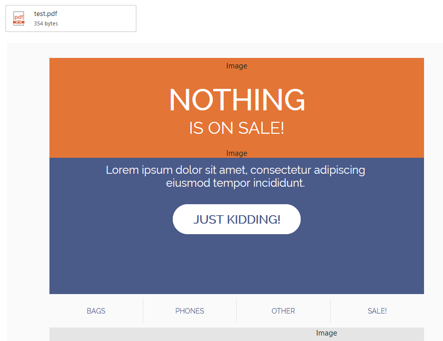

# Fishy

Send Email Attachments to Office Accounts.

**NOTE**: To test the HTML, I used this: https://beefree.io/templates/

## Usage:

```bash
usage: fishy.py [-h] -u  [-p] -t  -a  -e  [--smtp-server] [--smtp-port]

Fish.

optional arguments:
  -h, --help            show this help message and exit
  -u , --sender-address 
                        Username to authenticate with (Office)
  -p , --sender-password 
                        Password to authenticate with (Office)
  -t , --target-address 
                        Victim Email Address
  -a , --attachment     Attachment to send
  -e , --html-email     HTML Body for Email
  --smtp-server         SMTP Server Address
  --smtp-port           SMTP Server Port
```

## Example

```
[+] Reading from emailtemplate.html
[+] Reading from emailtemplate.html
[+] Sending 101672 to <email>!
[+] Connected to smtp.office365.com:587!
[+] Authenticated as <email>!
[+] Email Succesfully sent!
```

